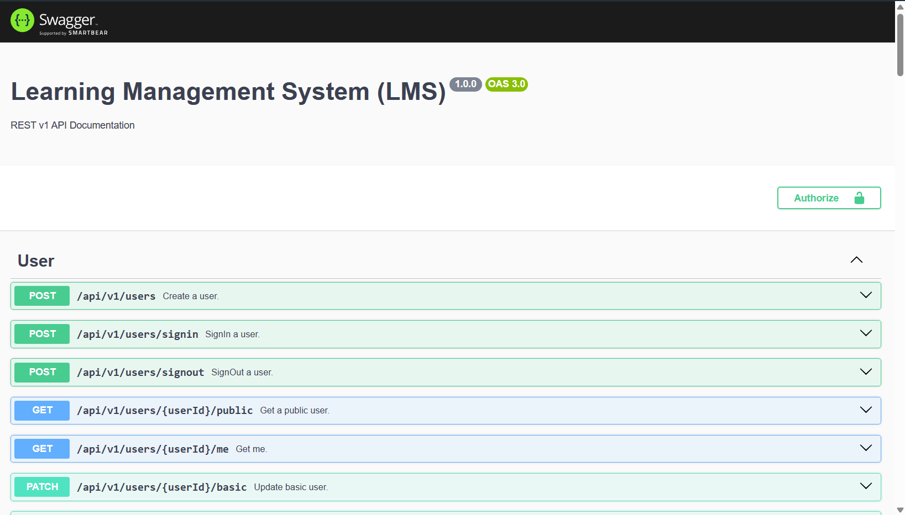

# Learning Management System | Server Side

# About

A centralized system Himpunan Mahasiswa Teknik Mesin ITB. This project implemented Clean Architecture that emphasizes
Separation of Concern (SoC).
Some logic are implemented in the database layer using trigger to ensure data consistency while maintaining the business
logic in the application layer.

# Technology

1. Nodejs (runtime environment)
2. Typescript & SQL (Language)
3. PostgreSQL
4. Express.js
5. PrismaORM
6. Docker

## Entity Relationship Diagram (ERD)

## API Documentation

`Link:` https://lms-server-delta.vercel.app/api-docs/ [Outdated]

