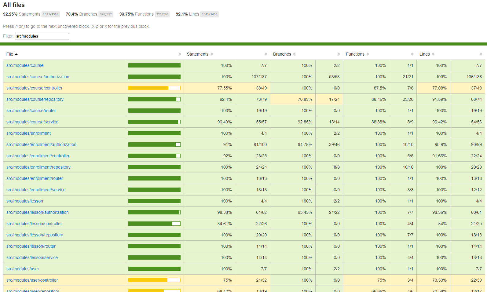

# Learning Management System | Server Side

## This project is under development

## Architecure | 4-layer Architecture

## Entitiy Relationship Diagram (ERD)

## API Documentation

Link: _currently unavailable_

## Unit Test (92.1% Line Coverage)

## Authorization List

- ### [Enrollment](#Enrollment)

1. #### [Creating Enrollment](#CreatingEnrollment)
2. #### [Updating Enrollment](#UpdatingEnrollment)
3. #### [Deleting Enrollment](#DeletingEnrollment)
4. #### [Updating Role Rule](#UpdatingRoleRule)

- ### [Course](#Course)

1. #### [Creating Course](#CreatingCourse)
2. #### [Fetching Course Including Videos](#FecthingCourseIncludingVideos)
3. #### [Fetching Course Excluding Videos](#FetchingCourseExcludingVideos)
4. #### [Updating Course](#UpdatingCourse)
5. #### [Deleting Course](#Deleting course)

- ### [Lesson/Video](#LessonOrVideo)

1. #### [Creating Lesson/Video](#CreatingLessonOrVideo)
2. #### [Fetching Lesson](#FetchingLesson)
3. #### [Fecthing Video](#FecthingVideo)
4. #### [Updating Lesson/Video](#UpdatingLessonOrVideo)
5. #### [Deleting Lesson/Video](#DeletingLessonOrVideo)

---

## Enrollment

- ### Creating Enrollment

| Role                     | Enrolling for Themselves | Enrolling for Others      |
|--------------------------|--------------------------|---------------------------| 
| **Student**              | `[STUDENT]`              | `Unauthorized`            
| **Instructor & !Author** | `[STUDENT]`              | `Unauthorized`            
| **Instructor & Author**  | `Unauthorized`           | `Unauthorized`            
| **Admin & !Author**      | `[STUDENT, INSTRUCTOR]`  | `[STUDENT*, INSTRUCTOR*]` 
| **Admin & Author**       | `Unauthorized`           | `[STUDENT*, INSTRUCTOR*]` 

- ### Updating Enrollment

| Role & Authorship        | Updating for Themselves | Updating for Others |
|--------------------------|-------------------------|---------------------|
| **Student**              | `Unauthorized`          | `Unauthorized`      |
| **Instructor & !Author** | `Unauthorized`          | `Unauthorized`      |
| **Instructor & Author**  | ``Unauthorized``        | `Permitted`         |
| **Admin & !Author**      | `Permitted`             | `Permitted`         |
| **Admin & Author**       | `-`                     | `Permitted`         |

- ### Deleting Enrollment

| Role & Authorship        | Updating for Themselves | Deleting for Others |
|--------------------------|-------------------------|---------------------|
| **Student**              | `Permitted`             | `Unauthorized`      |
| **Instructor & !Author** | `Permitted`             | `Unauthorized`      |
| **Instructor & Author**  | `-`                     | `Permitted`         |
| **Admin & !Author**      | `Permitted`             | `Permitted`         |
| **Admin & Author**       | `-`                     | `Permitted`         |

- ### Updating Role Rule

| User Role      | STUDENT &rarr; INSTRUCTOR | INSTRUCTOR &rarr; STUDENT |
|----------------|---------------------------|---------------------------|
| **Student**    | `Unauthorized`            | `-`                       |
| **Instructor** | `Permitted`               | `Permitted`               |
| **Admin**      | `Permitted`               | `Permitted`               |

---

## Role

- ### Creating Course

| Role       | Permission     |
|------------|----------------|
| Student    | `Unauthorized` |
| Instructor | `Permitted`    |
| Admin      | `Permitted`    |

- ### Fetching Course and Include Videos

| Role & Authorship        | Enrolled    | Unenrolled     |
|--------------------------|-------------|----------------|
| **Student**              | `Permitted` | `Unauthorized` |
| **Instructor & !Author** | `Permitted` | `Unauthorized` |
| **Instructor & Author**  | `-`         | `Permitted`    |
| **Admin & !Author**      | `Permitted` | `Permitted`    |
| **Admin & Author**       | `-`         | `Permitted`    |

- ### Fetching Course and Exclude Videos

| Role & Authorship        | Enrolled    | Unenrolled  |
|--------------------------|-------------|-------------|
| **Student**              | `Permitted` | `Permitted` |
| **Instructor & !Author** | `Permitted` | `Permitted` |
| **Instructor & Author**  | `-`         | `Permitted` |
| **Admin & !Author**      | `Permitted` | `Permitted` |
| **Admin & Author**       | `-`         | `Permitted` |

- ### Updating Course

| Role & Authorship        | Enrolled       | Unenrolled     |
|--------------------------|----------------|----------------|
| **Student**              | `Unauthorized` | `Unauthorized` |
| **Instructor & !Author** | `[INSTRUCTOR]` | `Unauthorized` |
| **Instructor & Author**  | `-`            | `Permitted`    |
| **Admin & !Author**      | `Permitted`    | `Permitted`    |
| **Admin & Author**       | `-`            | `Permitted`    |

- ### Deleting Course

| Role & Authorship        | Enrolled       | Unenrolled     |
|--------------------------|----------------|----------------|
| **Student**              | `Unauthorized` | `Unauthorized` |
| **Instructor & !Author** | `Unauthorized` | `Unauthorized` |
| **Instructor & Author**  | `-`            | `Permitted`    |
| **Admin & !Author**      | `Permitted`    | `Permitted`    |
| **Admin & Author**       | `-`            | `Permitted`    |

---

## Lesson / Video

### Creating Lesson / Video

| Role & Authorship        | Enrolled       | Unenrolled     |
|--------------------------|----------------|----------------|
| **Student**              | `Unauthorized` | `Unauthorized` |
| **Instructor & !Author** | `[INSTRUCTOR]` | `Unauthorized` |
| **Instructor & Author**  | `-`            | `Permitted`    |
| **Admin & !Author**      | `Permitted`    | `Permitted`    |
| **Admin & Author**       | `-`            | `Permitted`    |

### Fetching Lesson

| Role & Authorship        | Enrolled    | Unenrolled  |
|--------------------------|-------------|-------------|
| **Student**              | `Permitted` | `Permitted` |
| **Instructor & !Author** | `Permitted` | `Permitted` |
| **Instructor & Author**  | `-`         | `-`         |
| **Admin & !Author**      | `Permitted` | `Permitted` |
| **Admin & Author**       | `-`         | `-`         |

### Fetching Video

| Role & Authorship        | Enrolled    | Unenrolled     |
|--------------------------|-------------|----------------|
| **Student**              | `Permitted` | `Unauthorized` |
| **Instructor & !Author** | `Permitted` | `Unauthorized` |
| **Instructor & Author**  | `-`         | `Permitted`    |
| **Admin & !Author**      | `Permitted` | `Permitted`    |
| **Admin & Author**       | `-`         | `Permitted`    |

### Updating Lesson / Video

| Role & Authorship        | Enrolled       | Unenrolled     |
|--------------------------|----------------|----------------|
| **Student**              | `Unauthorized` | `Unauthorized` |
| **Instructor & !Author** | `[INSTRUCTOR]` | `Unauthorized` |
| **Instructor & Author**  | `-`            | `Permitted`    |
| **Admin & !Author**      | `Permitted`    | `Permitted`    |
| **Admin & Author**       | `-`            | `Permitted`    |

### Deleting Lesson / Video

| Role & Authorship        | Enrolled       | Unenrolled     |
|--------------------------|----------------|----------------|
| **Student**              | `Unauthorized` | `Unauthorized` |
| **Instructor & !Author** | `[INSTRUCTOR]` | `Unauthorized` |
| **Instructor & Author**  | `-`            | `Permitted`    |
| **Admin & !Author**      | `Permitted`    | `Permitted`    |
| **Admin & Author**       | `-`            | `Permitted`    |
