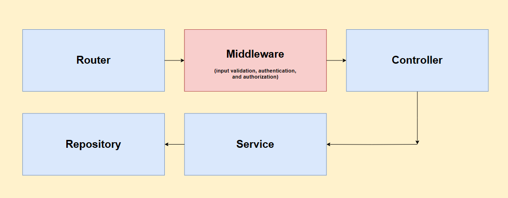
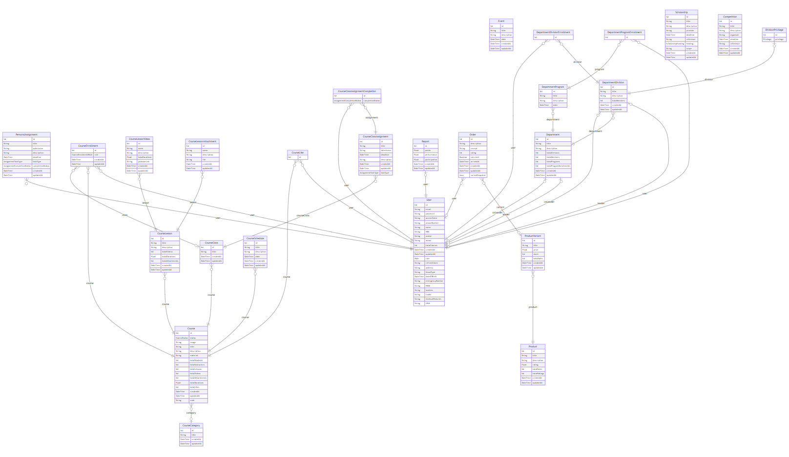
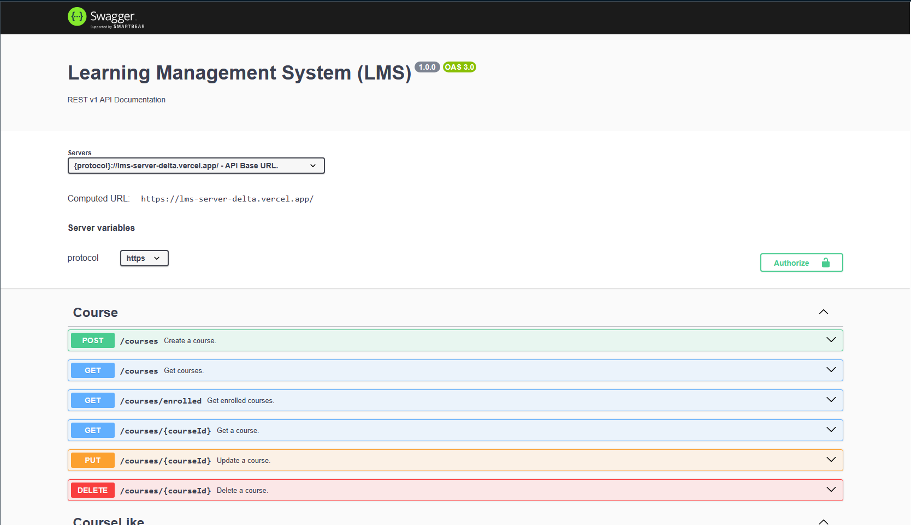

# Learning Management System | Server Side

## Entitiy Relationship Diagram (ERD)

## API Documentation

Link: https://lms-server-delta.vercel.app/api-docs/ (In progress)

## Authorization List

- ### [Enrollment](#Enrollment)
1. [X] [Creating Enrollment](#CreatingEnrollment)
2. [X] [Updating Enrollment](#UpdatingEnrollment)
3. [X] [Deleting Enrollment](#DeletingEnrollment)
4. [X] [Updating Role Rule](#UpdatingRoleRule)

- ### [Course](#Course)
1. [X] [Creating Course](#CreatingCourse)
2. [X] [Fetching Course Including Videos](#FecthingCourseIncludingVideos)
3. [X] [Fetching Course Excluding Videos](#FetchingCourseExcludingVideos)
4. [X] [Updating Course](#UpdatingCourse)
5. [X] [Deleting Course](#Deleting course)

- ### [Lesson/Video](#LessonOrVideo)
1. [X] [Creating Lesson/Video](#CreatingLessonOrVideo)
2. [X] [Fetching Lesson](#FetchingLesson)
3. [X] [Fecthing Video](#FecthingVideo)
4. [X] [Updating Lesson/Video](#UpdatingLessonOrVideo)
5. [X] [Deleting Lesson/Video](#DeletingLessonOrVideo)

---

## Enrollment

1. [X] **Creating Enrollment**

| Role                    | Enrolling for Themself    | Enrolling for Other       |
|-------------------------|---------------------------|---------------------------| 
| **Student**             | `[STUDENT]`               | `Unauthorized`            
| **Student & Author**    | `InternalServerException` | `InternalServerException` 
| **Instructor**          | `[STUDENT]`               | `Unauthorized`            
| **Instructor & Author** | `Unauthorized`            | `Unauthorized`            
| **Admin**               | `Permitted`               | `Permitted`               
| **Admin & Author**      | `Unauthorized`            | `Permitted`               

2. [X] **Updating Enrollment**

| Role & Authorship       | Updating for Themselves   | Updating for Others       |
|-------------------------|---------------------------|---------------------------|
| **Student**             | `Unauthorized`            | `Unauthorized`            |
| **Student & Author**    | `InternalServerException` | `InternalServerException` |
| **Instructor**          | `Unauthorized`            | `Unauthorized`            |
| **Instructor & Author** | `InternalServerException` | `Permitted`               |
| **Admin**               | `Permitted`               | `Permitted`               |
| **Admin & Author**      | `InternalServerException` | `Permitted`               |

3. [X] **Deleting Enrollment**

| Role & Authorship       | Deleting for Themselves   | Deleting for Others       |
|-------------------------|---------------------------|---------------------------|
| **Student**             | `Permitted`               | `Unauthorized`            |
| **Student & Author**    | `InternalServerException` | `InternalServerException` |
| **Instructor**          | `Permitted`               | `Unauthorized`            |
| **Instructor & Author** | `InternalServerException` | `Permitted`               |
| **Admin**               | `Permitted`               | `Permitted`               |
| **Admin & Author**      | `InternalServerException` | `Permitted`               |

4. [X] **Updating Role Rule**

| Target User Role | STUDENT &rarr; INSTRUCTOR | INSTRUCTOR &rarr; STUDENT |
|------------------|---------------------------|---------------------------|
| **Student**      | `Forbidden`               | `InternalServerException` |
| **Instructor**   | `Permitted`               | `Permitted`               |
| **Admin**        | `Permitted`               | `Permitted`               |

---

## Course

1. [X] **Creating Course**

| Role       | Permission     |
|------------|----------------|
| Student    | `Unauthorized` |
| Instructor | `Permitted`    |
| Admin      | `Permitted`    |

2. [X] **Fetching Course/Courses**

| Role & Authorship        | Enrolled                  | Unenrolled    |
|--------------------------|---------------------------|---------------|
| **Student**              | `Permitted`               | `Permitted`   |
| **Instructor & !Author** | `Permitted`               | `Permitted`   |
| **Instructor & Author**  | `InternalServerException` | `Permitted`   |
| **Admin & !Author**      | `Permitted`               | `Permitted`   |
| **Admin & Author**       | `InternalServerException` | `Permitted`   |

3. [X] **Updating Course**

| Role & Authorship        | Enrolled                  | Unenrolled     |
|--------------------------|---------------------------|----------------|
| **Student**              | `Unauthorized`            | `Unauthorized` |
| **Instructor & !Author** | `[INSTRUCTOR]`            | `Unauthorized` |
| **Instructor & Author**  | `InternalServerException` | `Permitted`    |
| **Admin & !Author**      | `Permitted`               | `Permitted`    |
| **Admin & Author**       | `InternalServerException` | `Permitted`    |

4. [X] **Deleting Course**

| Role & Authorship        | Enrolled                  | Unenrolled     |
|--------------------------|---------------------------|----------------|
| **Student**              | `Unauthorized`            | `Unauthorized` |
| **Instructor & !Author** | `Unauthorized`            | `Unauthorized` |
| **Instructor & Author**  | `InternalServerException` | `Permitted`    |
| **Admin & !Author**      | `Permitted`               | `Permitted`    |
| **Admin & Author**       | `InternalServerException` | `Permitted`    |

---

## Lesson / Video

1. [X] **Creating Lesson / Video**

| Role & Authorship        | Enrolled                  | Unenrolled     |
|--------------------------|---------------------------|----------------|
| **Student**              | `Unauthorized`            | `Unauthorized` |
| **Instructor & !Author** | `[INSTRUCTOR]`            | `Unauthorized` |
| **Instructor & Author**  | `InternalServerException` | `Permitted`    |
| **Admin & !Author**      | `Permitted`               | `Permitted`    |
| **Admin & Author**       | `InternalServerException` | `Permitted`    |

2. [X] **Fetching Lesson**

| Role & Authorship        | Enrolled                  | Unenrolled    |
|--------------------------|---------------------------|---------------|
| **Student**              | `Permitted`               | `Permitted`   |
| **Instructor & !Author** | `Permitted`               | `Permitted`   |
| **Instructor & Author**  | `InternalServerException` | `Permitted`   |
| **Admin & !Author**      | `Permitted`               | `Permitted`   |
| **Admin & Author**       | `InternalServerException` | `Permitted`   |

3. [X] **Fetching Video**

| Role & Authorship        | Enrolled                        | Unenrolled     |
|--------------------------|---------------------------------|----------------|
| **Student**              | `Permitted`                     | `Unauthorized` |
| **Instructor & !Author** | `Permitted`                     | `Unauthorized` |
| **Instructor & Author**  | `InternalServerException`       | `Permitted`    |
| **Admin & !Author**      | `Permitted`                     | `Permitted`    |
| **Admin & Author**       | `InternalServerException`       | `Permitted`    |

4. [X] **Updating Lesson / Video**

| Role & Authorship        | Enrolled                  | Unenrolled     |
|--------------------------|---------------------------|----------------|
| **Student**              | `Unauthorized`            | `Unauthorized` |
| **Instructor & !Author** | `[INSTRUCTOR]`            | `Unauthorized` |
| **Instructor & Author**  | `InternalServerException` | `Permitted`    |
| **Admin & !Author**      | `Permitted`               | `Permitted`    |
| **Admin & Author**       | `InternalServerException` | `Permitted`    |

5. [X] **Deleting Lesson / Video**

| Role & Authorship        | Enrolled                   | Unenrolled     |
|--------------------------|----------------------------|----------------|
| **Student**              | `Unauthorized`             | `Unauthorized` |
| **Instructor & !Author** | `[INSTRUCTOR]`             | `Unauthorized` |
| **Instructor & Author**  | `InternalServerException`  | `Permitted`    |
| **Admin & !Author**      | `Permitted`                | `Permitted`    |
| **Admin & Author**       | `InternalServerException ` | `Permitted`    |
