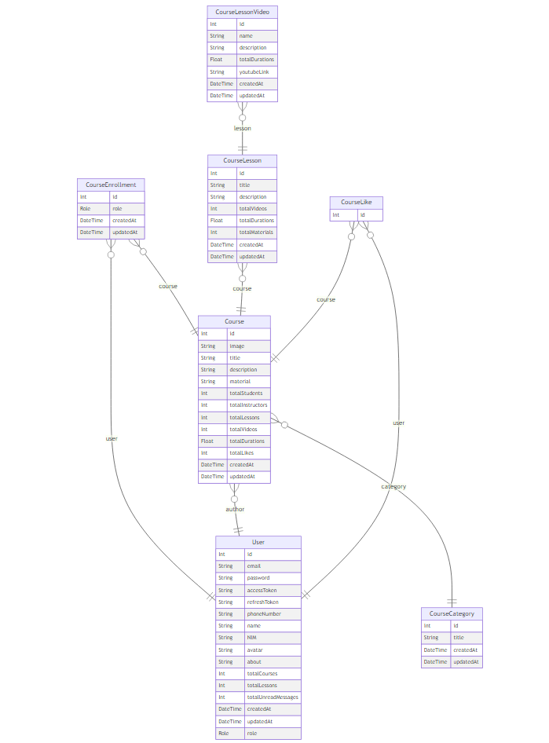
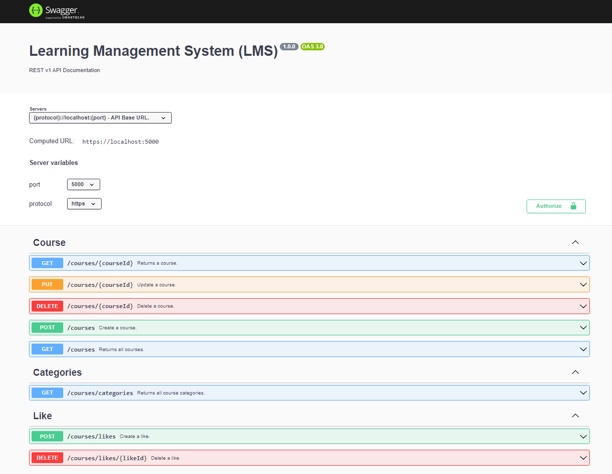

# Learning Management System | Server Side

## This project is under development

## Architecure | 4-layer Architecture


## Entitiy Relationship Diagram (ERD)


## API Documentation
Link: _currently unavailable_


## Unit Test (91.21% Line Coverage)


## Prisma Schema
```prisma
datasource db {
  provider = "mysql"
  url      = env("DATABASE_URL")
}

generator client {
  provider = "prisma-client-js"
}

model User {
  id                  Int      @id() @default(autoincrement())
  email               String   @unique
  password            String
  accessToken         String?  @map("access_token")
  refreshToken        String?  @map("refresh_token")
  phoneNumber         String?  @map("phone_number")
  name                String
  NIM                 String   @map("nim")
  avatar              String   @default("https://t4.ftcdn.net/jpg/05/49/98/39/360_F_549983970_bRCkYfk0P6PP5fKbMhZMIb07mCJ6esXL.jpg")
  about               String?
  totalCourses        Int      @default(0) @map("total_courses")
  totalLessons        Int      @default(0) @map("total_lessons")
  totalUnreadMessages Int      @default(0) @map("total_unread_messages")
  createdAt           DateTime @default(now()) @map("created_at")
  updatedAt           DateTime @updatedAt @map("updated_at")
  role                Role     @default(STUDENT)

  courses           Course[]
  courseEnrollments CourseEnrollment[]
  courseLikes       CourseLike[]

  @@map("user")
}

model CourseEnrollment {
  id        Int      @id @default(autoincrement())
  user      User     @relation(fields: [userId], references: [id])
  userId    Int      @map("user_id")
  course    Course   @relation(fields: [courseId], references: [id])
  courseId  Int      @map("course_id")
  role      Role     @default(STUDENT)
  createdAt DateTime @default(now()) @map("created_at")
  updatedAt DateTime @updatedAt @map("updated_at")

  @@unique([userId, courseId])
  @@map("course_enrollment")
}

model Course {
  id               Int      @id @default(autoincrement())
  image            String   @default("https://climate.onep.go.th/wp-content/uploads/2020/01/default-image.jpg")
  title            String
  description      String?
  material         String?
  totalStudents    Int      @default(0) @map("total_students")
  totalInstructors Int      @default(0) @map("total_instructors")
  totalLessons     Int      @default(0) @map("total_lessons")
  totalVideos      Int      @default(0) @map("total_videos")
  totalDurations   Float    @default(0) @map("total_durations")
  totalLikes       Int      @default(0) @map("total_likes")
  createdAt        DateTime @default(now()) @map("created_at")
  updatedAt        DateTime @updatedAt @map("updated_at")

  author   User @relation(fields: [authorId], references: [id])
  authorId Int  @map("author_id")

  category   CourseCategory @relation(fields: [categoryId], references: [id])
  categoryId Int            @map("category_id")

  enrollments CourseEnrollment[]
  lessons     CourseLesson[]
  likes       CourseLike[]

  @@index([id, authorId])
  @@map("course")
}

model CourseLesson {
  id             Int      @id @default(autoincrement())
  title          String
  description    String?
  totalVideos    Int      @default(0) @map("total_videos")
  totalDurations Float    @default(0) @map("total_durations")
  totalMaterials Int      @default(0) @map("total_materials")
  createdAt      DateTime @default(now()) @map("created_at")
  updatedAt      DateTime @updatedAt @map("updated_at")

  course   Course @relation(fields: [courseId], references: [id])
  courseId Int    @map("course_id")

  videos CourseLessonVideo[]

  @@map("course_lesson")
}

model CourseLessonVideo {
  id             Int      @id @default(autoincrement())
  name           String
  description    String?
  totalDurations Float    @map("total_durations")
  youtubeLink    String   @map("youtube_link")
  createdAt      DateTime @default(now()) @map("created_at")
  updatedAt      DateTime @updatedAt @map("updated_at")

  lesson   CourseLesson @relation(fields: [lessonId], references: [id])
  lessonId Int          @map("lesson_id")

  @@map("course_video")
}

model CourseLike {
  id Int @id @default(autoincrement())

  course   Course @relation(fields: [courseId], references: [id])
  courseId Int    @map("course_id")
  user     User   @relation(fields: [userId], references: [id])
  userId   Int    @map("user_id")

  @@unique([courseId, userId])
  @@map("course_like")
}

model CourseCategory {
  id        Int      @id @default(autoincrement())
  title     String
  createdAt DateTime @default(now()) @map("created_at")
  updatedAt DateTime @updatedAt @map("updated_at")

  courses Course[]

  @@map("course_category")
}

enum Role {
  OWNER
  INSTRUCTOR
  STUDENT
}
```


## User


## Course


## Enrollment


## Lesson


## Video


## Enrollment
---
#### Creating Enrollment
| Role | Enrolling Identic User | Enrolling Different User|
| ------ | ------ | ------ | 
| Student | [STUDENT] | Unauthorized
| Instructor & !Author| [STUDENT]| Unauthorized
| Instructor & Author | Unauthorized | Unauthorized
| Admin & !Author | Permitted | Permitted
| Admin & Author | Unauthorized | Permitted

#### Updating Enrollment
| Role & Authorship | Updating Identic User | Updating Different User |
| ------ | ------ | ------ |
| Student | Unauthorized | Unauthorized |
| Instructor & !Author | Unauthorized | Unauthorized |
| Instructor & Author | - | Permitted |
| Admin & !Author | Permitted| Permitted |
| Admin & Author | - | Permitted |

#### Deleting Enrollment
| Role & Authorship | Deleting Identic User | Deleting Different user |
| ------ | ------ | ------ |
| Student | Permitted | Unauthorized |
| Instructor & !Author | Permitted | Unauthorized |
| Instructor & Author | - | Permitted |
| Admin & !Author | Permitted| Permitted |
| Admin & Author | - | Permitted |

#### Updating Role Rule
| User Role | STUDENT -> INSTRUCTOR | INSTRUCTOR -> STUDENT |
| ------ | ------ | ------ |
| Student | Unauthorized | - |
| Instructor | Permitted | Permitted |
| Admin | Permitted| Permitted |

## Role
-----
#### Creating Course
| Role | Permission |
| ------ | ------ |
| Student | Unauthorized |
| Instructor | Permitted |
| Admin| Permitted|

#### Reading Course and Include Videos
| Role & Authorship | Enrolled  | Unenrolled |
| ------ | ------ | ------ |
| Student | Permitted | Unauthorized |
| Instructor & !Author | Permitted| Unauthorized |
| Instructor & Author | - | Permitted |
| Admin & !Author | Permitted| Permitted |
| Admin & Author | - | Permitted |

#### Reading Course and Exclude Videos
| Role & Authorship | Enrolled | Unenrolled |
| ------ | ------ | ------ |
| Student | Permitted | Permitted |
| Instructor & !Author | Permitted| Permitted |
| Instructor & Author | - | Permitted |
| Admin & !Author | Permitted| Permitted |
| Admin & Author | - | Permitted |

#### Reading Instructor and Owned Courses
| Role | Permission |
| ------ | ------ |
| Student | Unauthorized |
| Instructor | Permitted |
| Admin| Permitted|

#### Updating Course
| Role & Authorship | Enrolled | Unenrolled |
| ------ | ------ | ------ |
| Student | Unauthorized | Unauthorized |
| Instructor & !Author | [INSTRUCTOR]| Unauthorized |
| Instructor & Author | - | Permitted |
| Admin & !Author | Permitted| Permitted |
| Admin & Author | - | Permitted |

#### Deleting Course
| Role & Authorship | Enrolled | Unenrolled |
| ------ | ------ | ------ |
| Student | Unauthorized | Unauthorized |
| Instructor & !Author | Unauthorized | Unauthorized |
| Instructor & Author | - | Permitted |
| Admin & !Author | Permitted| Permitted |
| Admin & Author | - | Permitted |

## Lesson / Video
---
#### Creating Lesson / Video
| Role & Authorship | Enrolled | Unenrolled |
| ------ | ------ | ------ |
| Student | Unauthorized | Unauthorized |
| Instructor & !Author| [INSTRUCTOR]| Unauthorized |
| Instructor & Author | - | Permitted |
| Admin & !Author | Permitted| Permitted |
| Admin & Author | - | Permitted |

#### Reading Lesson
| Role | Permission |
| ------ | ------ |
| Student | Permitted |
| Instructor | Permitted |
| Admin| Permitted|

#### Updating Lesson / Video
| Role & Authorship | Enrolled | Unenrolled |
| ------ | ------ | ------ |
| Student | Unauthorized | Unauthorized |
| Instructor & !Author | [INSTRUCTOR]| Unauthorized |
| Instructor & Author | - | Permitted |
| Admin & !Author | Permitted| Permitted |
| Admin & Author | - | Permitted |

#### Deleting Lesson / Video
| Role & Authorship | Enrolled | Unenrolled |
| ------ | ------ | ------ |
| Student | Unauthorized | Unauthorized |
| Instructor & !Author | [INSTRUCTOR]| Unauthorized |
| Instructor & Author | - | Permitted |
| Admin & !Author | Permitted| Permitted |
| Admin & Author | - | Permitted |
